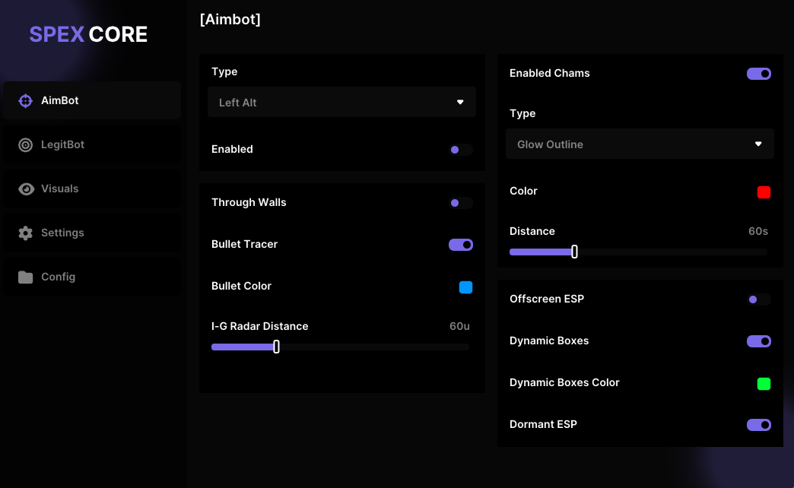

<div align="center">

# 🎯 SpeXCore CheatBase



### 🚀 A Modern Global Cheat Base with ImGui Custom Menu

[](LICENSE)
[](https://isocpp.org/)
[](https://docs.microsoft.com/en-us/windows/win32/directx)
[](https://github.com/ocornut/imgui)
[](https://www.microsoft.com/windows/)

[](https://github.com/spexdw/SpeXCore-CheatBase/stargazers)
[](https://github.com/spexdw/SpeXCore-CheatBase/network/members)
[](https://github.com/spexdw/SpeXCore-CheatBase/issues)
[](https://github.com/spexdw/SpeXCore-CheatBase/commits)

---

*A comprehensive, modern cheat base framework with advanced ImGui integration, DirectX 11 rendering, and modular architecture designed for educational purposes and game development research.*

</div>

## 🌟 Overview

**SpeXCore CheatBase** is a sophisticated, educational cheat base framework built with modern C++ and advanced graphics rendering. This project demonstrates professional-grade software architecture, DirectX 11 integration, and custom ImGui menu systems for educational and research purposes.


## 🚀 Quick Start

### 📋 Prerequisites

Before you begin, ensure you have:

- 🖥️ **Windows 10/11** (x64)
- 🛠️ **Visual Studio 2022** with C++ support
- 📦 **Windows SDK** (latest version)
- 🎯 **DirectX 11 SDK**

### ⚡ Installation

1. **Clone the Repository**
   ```bash
   git clone https://github.com/spexdw/SpeXCore-CheatBase.git
   cd SpeXCore-CheatBase
   ```
2. **Open in Visual Studio**
   ```bash
   #Open the solution file
   start SpeXCore-CheatBase.sln
   ```
3. **Build Configuration**
   <p>
   Set configuration to Debug or Release <br>
   Set platform to x64 <br>
   Build the solution (Ctrl+Shift+B)</p>


---

## 📁 Project Structure
```bash
SpeXCore-CheatBase/
├── src/
│   ├── core/
│   │   ├── globals.h         -> Global variable declarations
│   │   └── globals.cpp       -> Implementation of global logic
│   ├── memory/
│   │   ├── memory.h          -> Memory Veriables.
│   │   └── memory.cpp        -> Memory Implementation.
│   ├── cheats/               -> All Cheats like Aimbot/Aimbot.cpp
│   ├── hooks/
│   │   ├── directx.h         -> DirectX hooking interface
│   │   ├── directx.cpp       -> DirectX hook implementation
│   │   ├── wndproc.h         -> WndProc hook header
│   │   └── wndproc.cpp       -> WndProc hook implementation
│   ├── gui/
│   │   ├── menu.h            -> Menu interface
│   │   ├── menu.cpp          -> Menu logic implementation
│   │   ├── custom_widgets.h  -> Custom ImGui widget declarations
│   │   ├── custom_widgets.cpp-> Widget implementations
│   │   ├── Font.h            -> Embedded font resc.
│   │   ├── image.h           -> Image resc.
│   │   ├── icons.h           -> Icon definitions 
│   │   ├── custom_colors.h   -> UI color definitions
│   │   └── custom_settings.h -> UI configuration
│   ├── imgui/
│   ├── utils/
│   │   ├── Logger.h          -> Logging system header
│   │   ├── Logger.cpp        -> Logger implementation
│   │   ├── FontManager.h     -> Font manager header
│   │   └── FontManager.cpp   -> Font manager implementation
│   └── main.cpp              -> Main application entry point

├── includes/                 -> Helpers.
├── lib/                      -> Lib Files.
├── demo.png                  -> Demo screenshot
├── README.md                 -> This file
└── LICENSE                   -> MIT License
```
---
